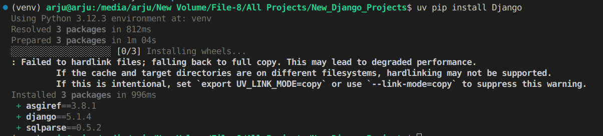

# djangoproject

### Project Setup
### Step 1: Create a virtual environment named venv
```bash
python3 -m venv venv
```


### Step 2: Activate the virtual environment
```bash
source venv/bin/activate
```


### Step 3: Install Django using uv
```bash
uv pip install Django
```


### Step 4: Create Django Project named djangoproject
```bash
django-admin startproject simple-django-project 
```


### Step 5: Go to djangoproject directory
```bash
cd djangoproject/
```

### Step 6: Run the project
```bash
python manage.py runserver
```
 </br>


### Step 7:  Create an app named products
```bash
python manage.py startapp products
```

### Step 8: Add products app in djangoproject settings


## Add Tailwind 
```bash
uv pip install django-tailwind
uv pip install 'django-tailwind[reload]'
```


### Resources:
1.  https://docs.astral.sh/uv/getting-started/installation/#next-steps
2. https://www.djangoproject.com/start/
3. https://jinja.palletsprojects.com/en/stable/
4. https://pypi.org/project/django-tailwind/